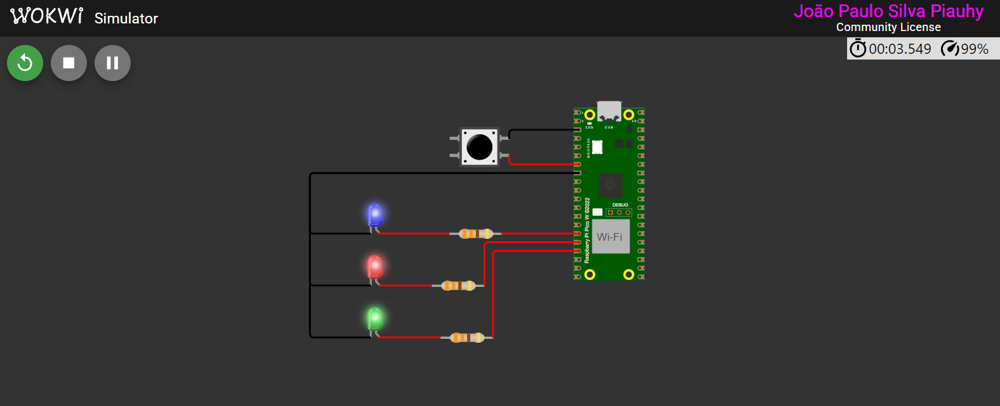

# Controle de LEDs com Raspberry Pi Pico

Este projeto implementa um sistema de controle de LEDs utilizando um **Raspberry Pi Pico**. O comportamento do sistema é baseado em um botão, que altera o estado dos LEDs de acordo com uma sequência predefinida.

## 📌 Funcionalidade

- Inicialmente, **todos os LEDs estão apagados**.
- No **primeiro pressionamento do botão**, todos os LEDs são acesos.
- A cada novo pressionamento, um LED é desligado na seguinte ordem:
  1. **Desliga o LED azul**
  2. **Desliga o LED vermelho**
  3. **Desliga o LED verde**
  4. **Reacende todos os LEDs** e o ciclo se repete.

  
_(Imagem ilustrativa do Temporizador de um Disparo em funcionamento)_

## 🛠️ Componentes necessários

- Raspberry Pi Pico
- 3 LEDs (azul, vermelho e verde)
- 3 resistores de **330Ω**
- 1 botão de pressão (push button)

## 🔌 Esquema de ligação

| Componente   | GPIO do Pico            |
| ------------ | ----------------------- |
| LED Azul     | 11                      |
| LED Vermelho | 12                      |
| LED Verde    | 13                      |
| Botão        | 5 (com pull-up interno) |

Cada LED deve ser conectado em série com um resistor de **330Ω**.

## 🚀 Como rodar o código

### 1️⃣ Configurar o ambiente de desenvolvimento

Para compilar e carregar o código no Raspberry Pi Pico, siga estes passos:

1. Instale o **SDK do Raspberry Pi Pico**
2. Configure um ambiente de desenvolvimento, como o **VS Code** com a extensão CMake.
3. Clone este repositório e compile o código com:
   ```sh
   mkdir build && cd build
   cmake ..
   make
   ```
4. Conecte o **Raspberry Pi Pico** no modo **bootloader** (segurando o botão BOOTSEL ao conectar via USB).
5. Copie o arquivo `.uf2` gerado para a unidade do Pico.

### 2️⃣ Executar o código

Após carregar o código, pressione o botão para alternar entre os estados dos LEDs.

## 🖥️ Estrutura do Código

- O código utiliza **interrupções (IRQ)** para detectar quando o botão é pressionado.
- Implementa um sistema de **debounce** para evitar múltiplas leituras erradas do botão.
- O estado atual dos LEDs é armazenado em uma variável `current_state` do tipo `enum`.

## 📜 Código Fonte

O código completo pode ser encontrado no arquivo [`TEMPORIZADOR_DISPARO.c`](TEMPORIZADOR_DISPARO.c).

## 📢 Autor

Projeto desenvolvido para fins educacionais e testes com o **Raspberry Pi Pico**.

---

**MIT License** - Sinta-se livre para modificar e usar este código! 🎯
